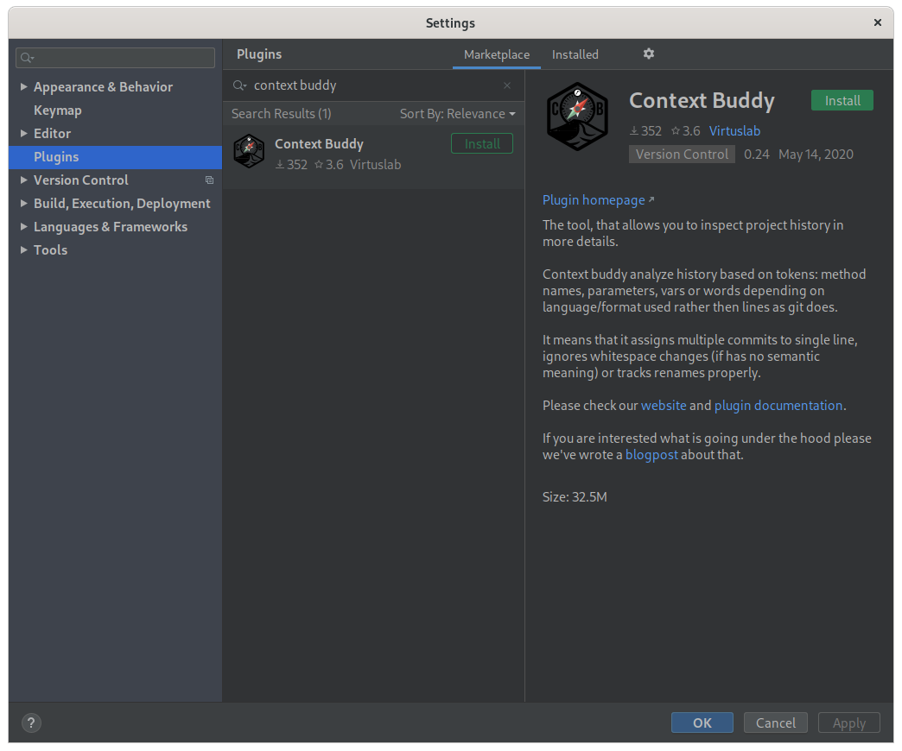
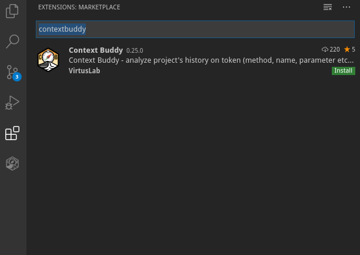

# Meet Context Buddy.

## The friend from work you never knew you needed. 

That is, until you joined a project with thirty years of legacy code. 
Or had your team leader suddenly leave you with little organisation skills and no knowledge of what should you do next. 
Or had to collaborate with another group, full of people with different opinions on what constitutes good code.
In case of any of these apocalyptic events, remember Context Buddy is here for you.

## Installation

Both IntelliJ and VSCode plugins can be installed via their respective marketplaces.

## How To Use Context Buddy

[VSCode](vscode/README.md)

[IntelliJ IDEA](intellij/README.md)

## Future plans

We are really close to being ready to work with your CI to generate and store the semantic history of your projects (symbols, origins, etc.). Stay tuned since release is coming :)

## Tell Us What You Think

Drop us an email at `contextbuddy@virtuslab.com`. We are looking for any feedback.
