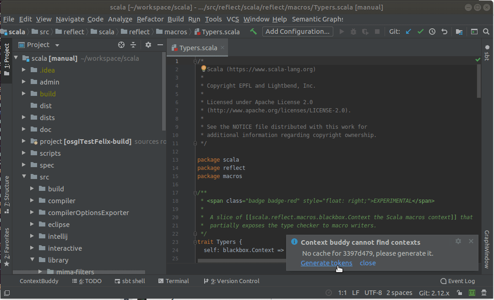
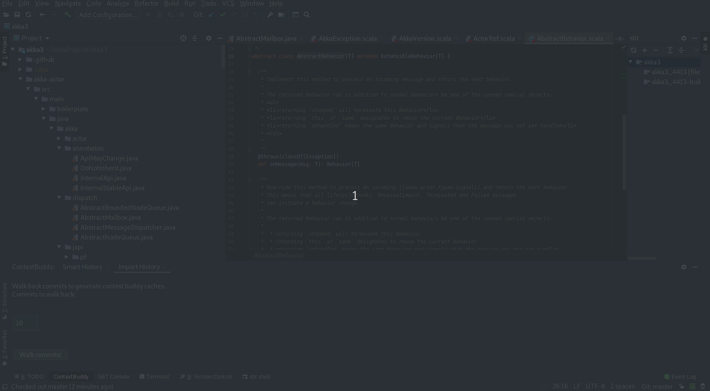

# Meet Context Buddy.

## The friend from work you never knew you needed. 

That is, until you joined a project with thirty years of legacy code. 
Or had your team leader suddenly leave you with little organisation skills and no knowledge of what should you do next. 
Or had to collaborate with another group, full of people with different opinions on what constitutes a good code.
In case of any of these apocalyptic events, remember

## Context Buddy Is Here For You
 
He might not know the answer to every question, but he can tell you who to ask. 
He'll also show you the rest of their changes for good measure. And you won't ever have to feel stupid for wasting his time 
afterwards.

## How To Use (With Examples)

To draw upon Context Buddy's knowledge, first let it gather it. 
After opening the plugin for the first time, listen to the popup and click on the Walk History tab.
Enter the number of commits you'd like Context Buddy to go through right now. 
(Remember, it's no the number of contexts Context Buddy will store in its memory, just the number of comments it will parse during this walk. 
Also, don't worry about overestimating the number of commits in your repo. 
Context Buddy will know when to stop its walk, it might just take it longer).

After updating the contexts, click on the file to let Context Buddy index and highlight it.
Later, Context Buddy will renew it on its own after every Intellij build.

To see all changes in a file caused by a specific commit, you can either:
- hover over one of the commit's lines, until you 
see a tooltip, and click on the commit hash,
 

- or choose one of the commits from Smart History's toggle.

In any case, the commit of your choice should change its highlight to a fashionable red, and gain a small line mark 
on the scrollbar.

To unmark the commit, click on Smart History's "Clear selection" button. To change the data provider, choose it from the toggle list
(that might prove to be more useful later; so far, Context Buddy should only support parsing and highlighting tokens).

Currently, Context Buddy supports data sources written in Java, Scala, Javascript and Python. But don't worry.
More is coming.

## Installation

Intellij plugin can be downloaded [here.](https://wip-repos.s3.eu-central-1.amazonaws.com/context-buddy-0.2.0-M12-SNAPSHOT.zip)
Later on plugin can be installed in Intellij by File -> Settings -> Plugins -> gear icon -> Install Plugin from disk

## A More Technical Explanation

Context Buddy is a tool that allows you to access and gather information about your project.

Its main source of knowledge is your and your team's git history. To properly highlight your files, Context Buddy
uses contexts extracted from your commit history, or - lacking it for a specific file - information taken from
`git blame`, providing the user with at least the name of the author of the change.

In order to save your time, Context Buddy synchronizes the repository asynchronously and parses only a given number 
of contexts in a single walk (and it might also gain some automatic updates during Scala and Typescript compilation in the future). 

To save up space on your machine, on the other hand, some changes will be included in the next version of Context Buddy.
This one: the first, free version will store your tokens only locally. In the paid version, though, Context Buddy will keep its storage in a remote, private repository, 
newly constructed for every user. 

## Future Plans

Our plans for the future include:
- adding visualisations based on semantic graphs,
- a CLI API,
- a scalac plugin, updating history with every compilation,
- detecting security risks in code, 
- more types of data providers,
- searching for expert for selected code without support for incremental changes (but detecting such situations)

## Tell Us What You Think
