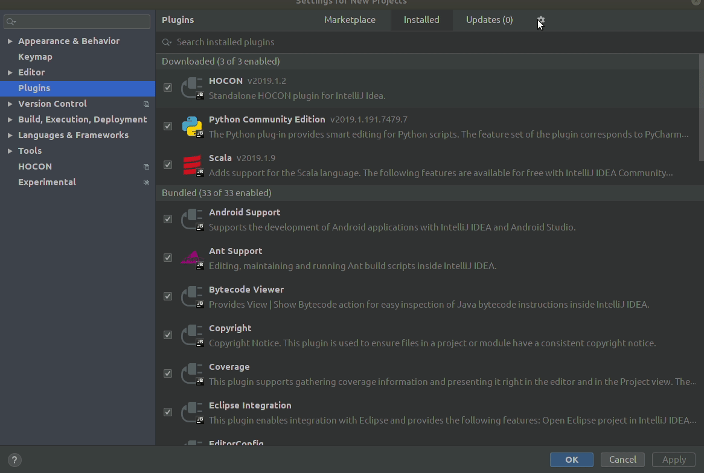
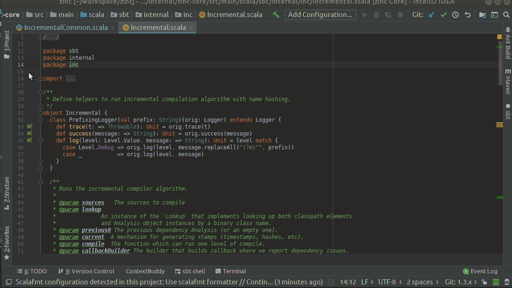
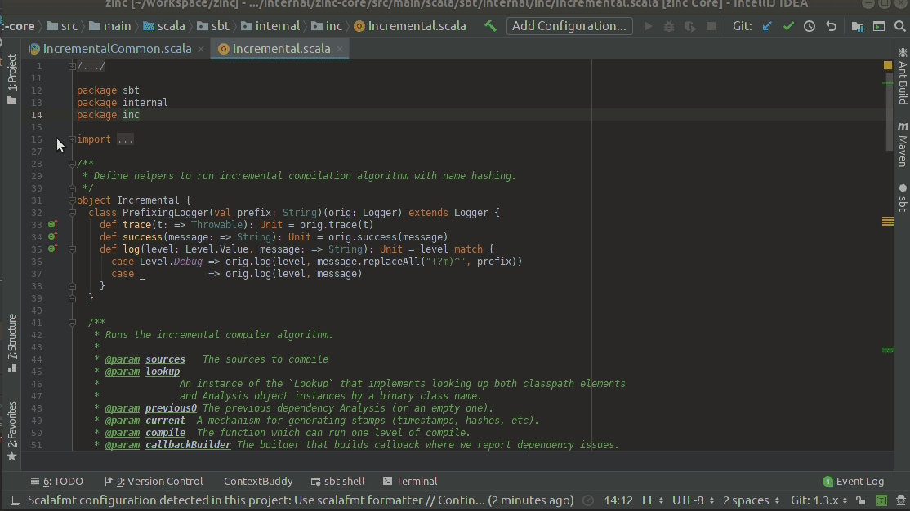
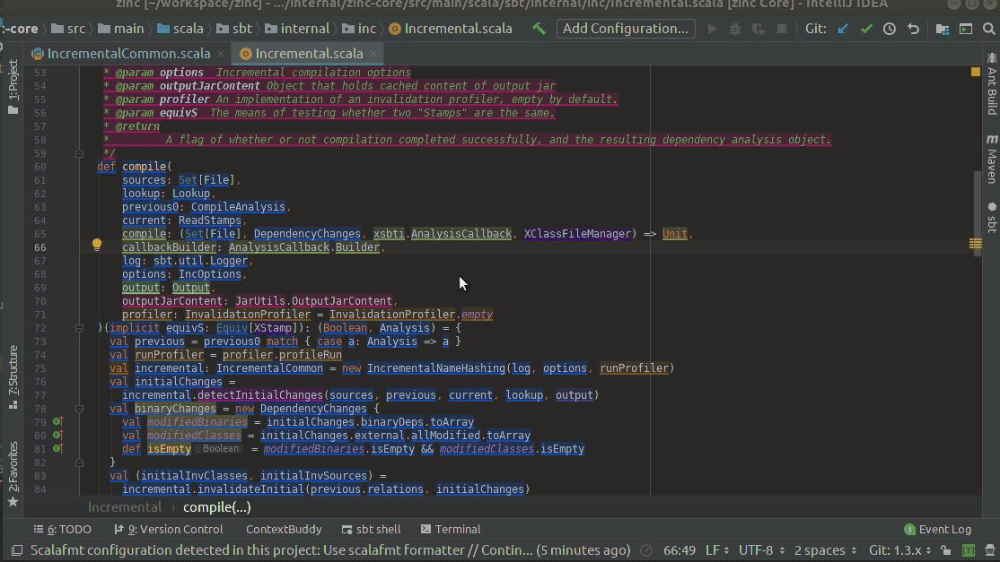
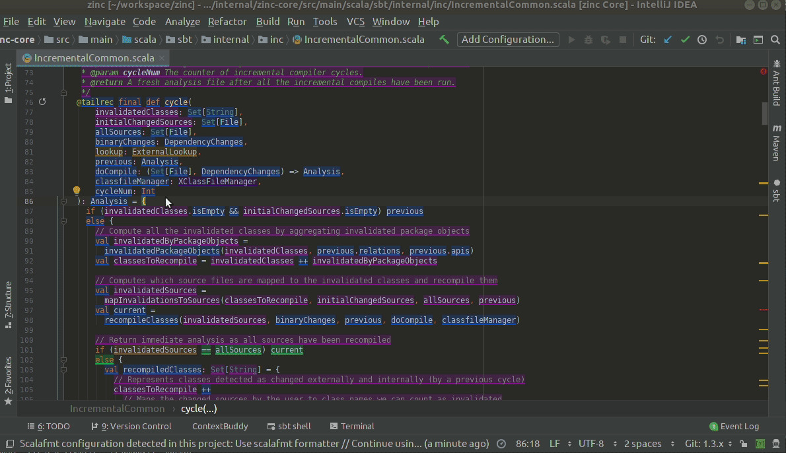

# Meet Context Buddy.

## The friend from work you never knew you needed. 

That is, until you joined a project with thirty years of legacy code. 
Or had your team leader suddenly leave you with little organisation skills and no knowledge of what should you do next. 
Or had to collaborate with another group, full of people with different opinions on what constitutes good code.
In case of any of these apocalyptic events, remember Context Buddy is here for you.

## Installation

Intellij plugin can be downloaded [here.](https://wip-repos.s3.eu-central-1.amazonaws.com/context-buddy-0.2.1-M2.zip)
Later on plugin can be installed in Intellij by File -> Settings -> Plugins -> gear icon -> Install Plugin from disk

We are on our way to Intellij Plugin Repository.

## How To Use (With Examples)

Context Buddy's Smart history behaves similarly to git blame. To turn it on you can either right-click on the left border of the editor or use quick action 'Smart History'.

Context buddy generates history on the fly and caches it in memory. Processing history in more detail is more expensive than just using `git blame` so it may take a few seconds to compute it (of course it happens asynchronously).

Conext buddy comes with a dedicated view where you can inspect history in more detail. You can take a look at the list of commits that provide meaningful changes to the file (keep in mind that e.g. rename or reformat commits will be omitted). 

To see all changes in a file caused by a specific commit, you can either:

- hover over one of the commit's lines, until you see a tooltip, and click on the commit hash
- or choose one of the commits from Smart History's toggle

In any case, the commit of your choice should change its highlight to a fashionable red, and gain a small line mark 
on the scrollbar.

To unmark the commit, click on Smart History's "Clear selection" button. To change the data provider, choose it from the toggle list
(that might prove to be more useful later; so far, Context Buddy should only support parsing and highlighting tokens).

Smart history is interactive. Context Buddy can pick up any change that you make to your file and render smart history based on it as long as file parses.

Currently, Context Buddy supports data sources written in **Java, Scala, Javascript, Typescript** and **Python**. We support **YAML** and **JSON** files. 
But don't worry. More is coming.

## Future plans

We are really close to being ready to work with your CI to generate and store the semantic history of your projects (symbols, origins, etc.). Stay tuned since release is coming :)

## Tell Us What You Think

Drop us an email at `contextbuddy@virtuslab.com`. We are looking for any feedback.
