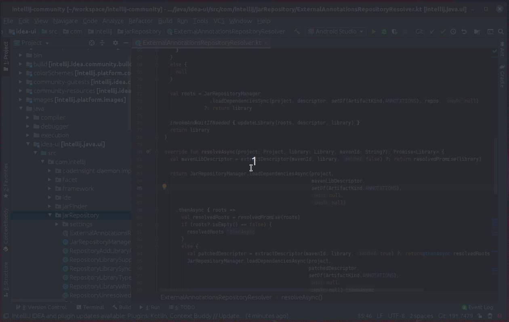
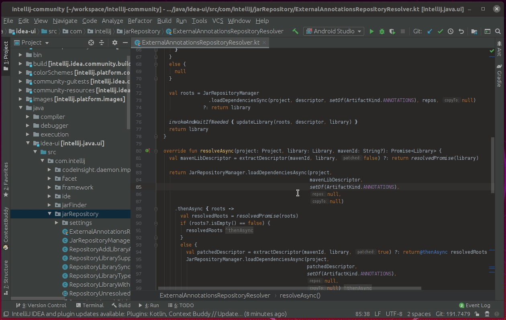
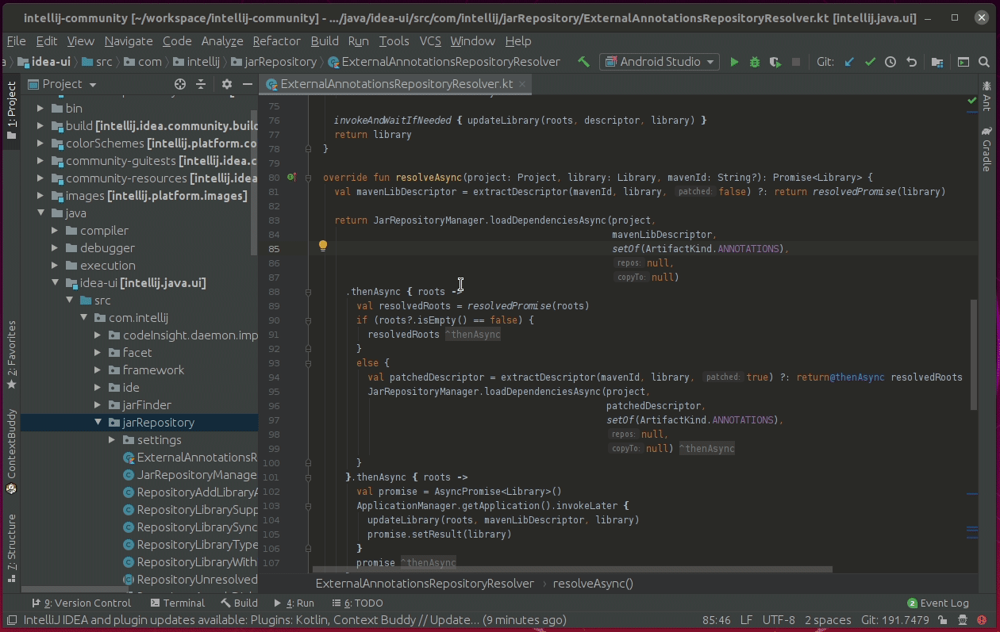
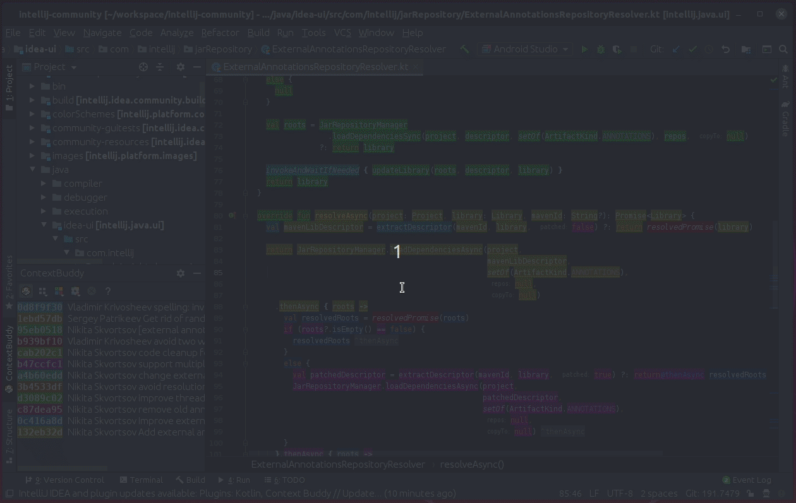
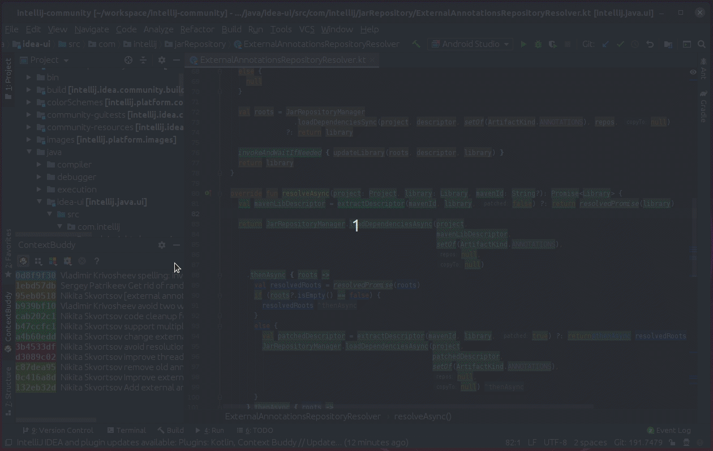
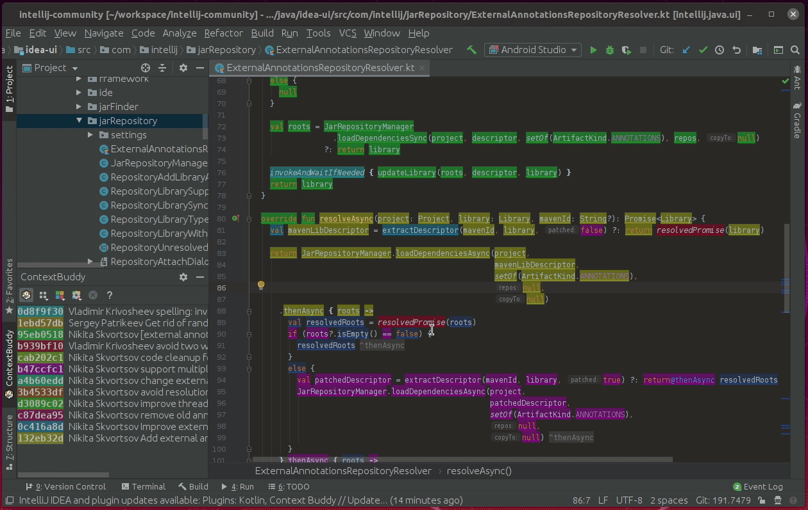
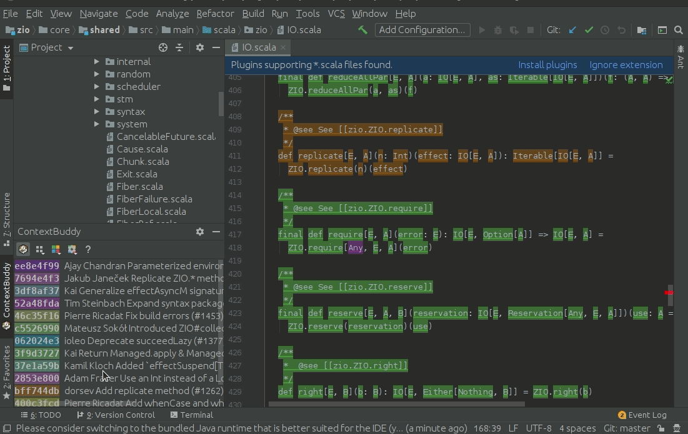

# Context Buddy

The tool that allows you to inspect project history in more detail. Context Buddy analyzes history based on tokens: method names, parameters, vars or words depending on language/format used rather than lines as git does.

It means that it assigns multiple commits to a single line, ignores whitespace changes (if they have no semantic meaning) or tracks file renames properly.

If you are interested in what's going on under the hood, please check out our [blogpost](https://medium.com/@m.bednarz/165dac84425).

## How to use Context Buddy

### Turning it on/off

Context buddy is not enabled by default, so that its highlighting doesn’t distract the developer all the time. To toggle Context Buddy for a given file, simply run 'Smart History' action.

As you may notice, it enables Context Buddy only for the current file.

Another way to switch Context Buddy on or off is to use button in the provided user interface.

### Highlights: Hovers and color

When turned on, Context buddy highlights each token in the file. The highlight color corresponds to the last commit that affected the token (see different options below).

Hover gives information about token, author, date as well as commit message. 

**Context buddy provides commits that actually changed given token so it may be different than commit that git blame provides**

### Highlight by: change the way colors are applied

Context buddy can provide different ways to assign colors to commits (and context where lastly changed by it).

Color settings can be changed using UI or provided actions.

Additionally, we provide options that can configure colors even further.

Context Buddy can highlight code by (with options):

 * **Hash** - unique color will be assigned for each commit
   * **static** - each commit has the same color assigned across all files (this may make colors less distinct among single file)
 * **Author** - unique color will be assigned for each commit with the same author
   * **static** - each author has the same color assigned across all files (this may make colors less distinct among single file)
 * **Months** - unique color will be assigned for each month as a period of time so November 2018 and November 2019 will have different colors assigned
   * **static** - each month has the same color assigned across all files (this may make colors less distinct among single file)
 * **History** - colors are picked from the gradient, based on git history. As a result, older commits will be assigned with a color similar to the start of gradient. On the other hand, newer commits will be assigned to the color similar to the end of it
   * **discrete** - colors will be picked using a fixed step in gradient (1/N) rather than distance based on relative difference of commit times
   * **reverse** - reverses the ordering
   * **fade** - color will fade out for older commits
   * **color from and to** - colors to construct the gradient

### Select single commit

Context buddy presents a list of all commits that affect the current file and allows us to highlight single commit (to e.g. analyze its impact). 

You can either select the commit once (so other commits are also highlighted) or twice (so only commit in question is highlighted).

   
