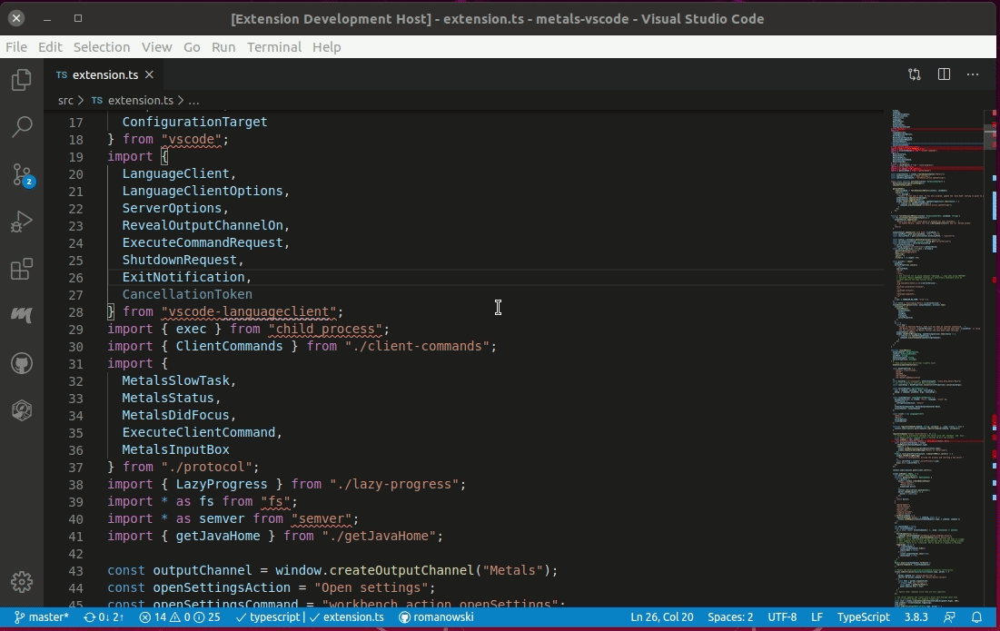
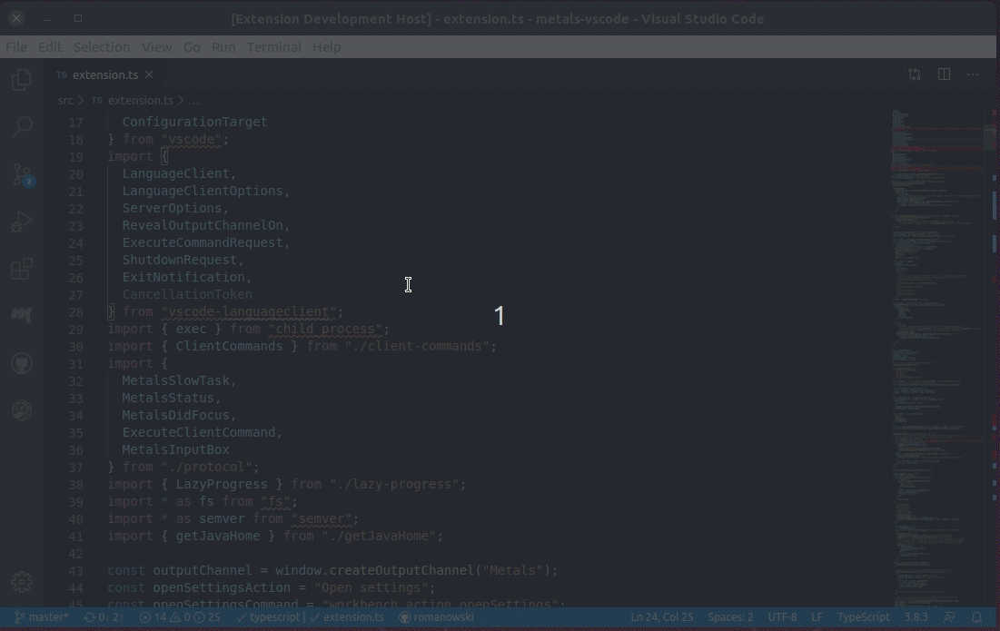
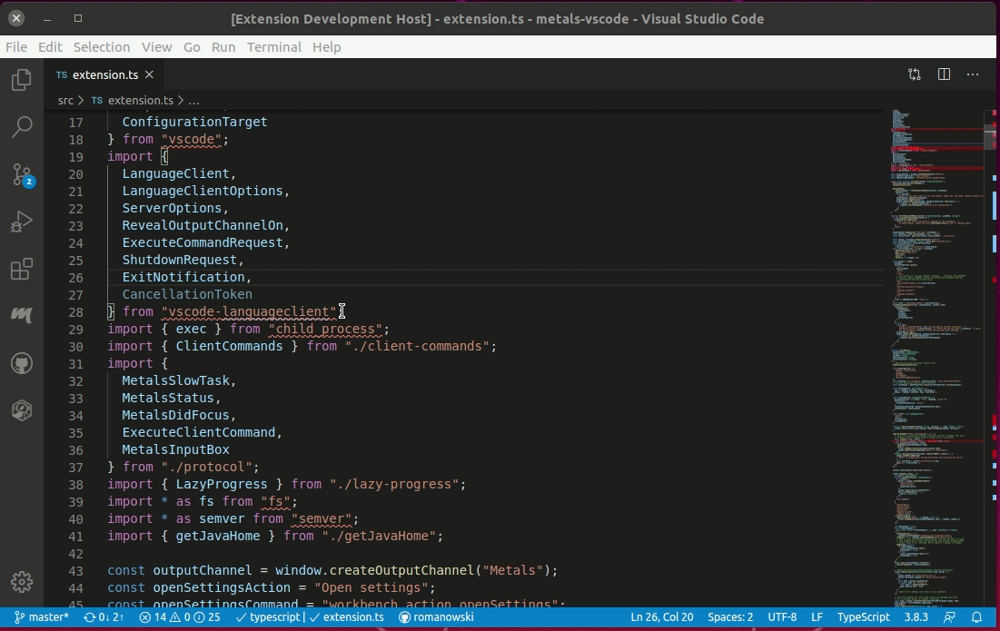
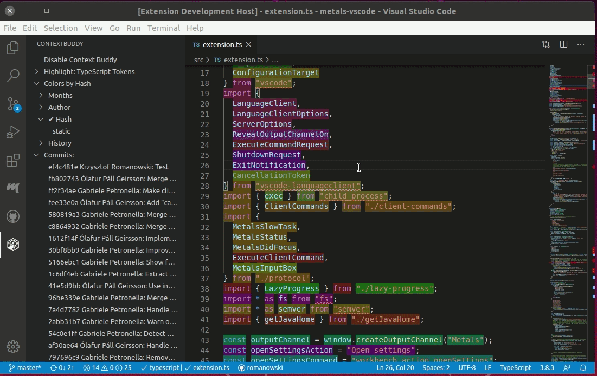
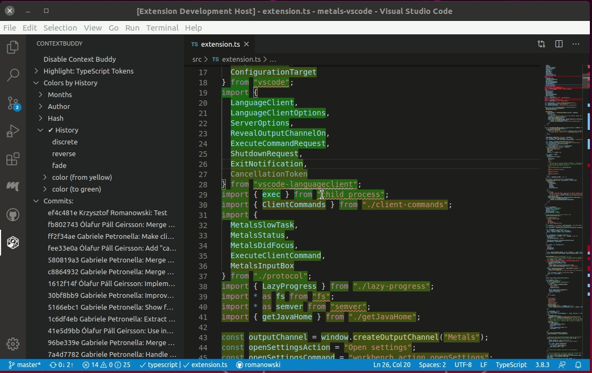
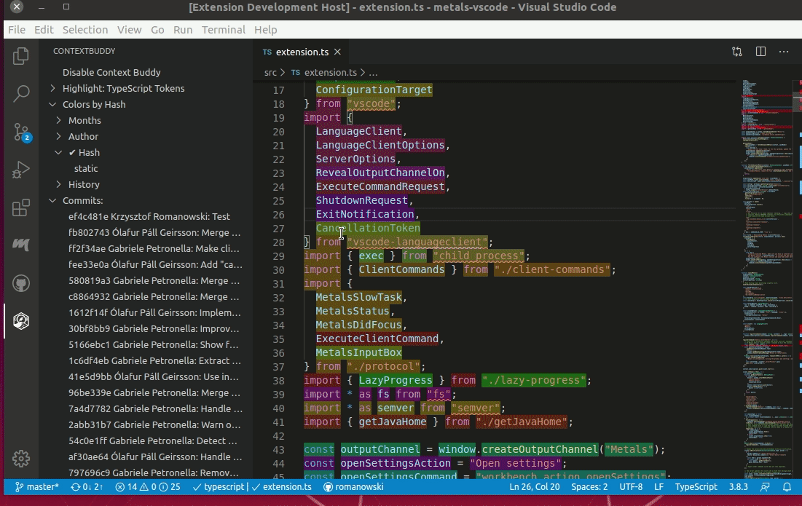
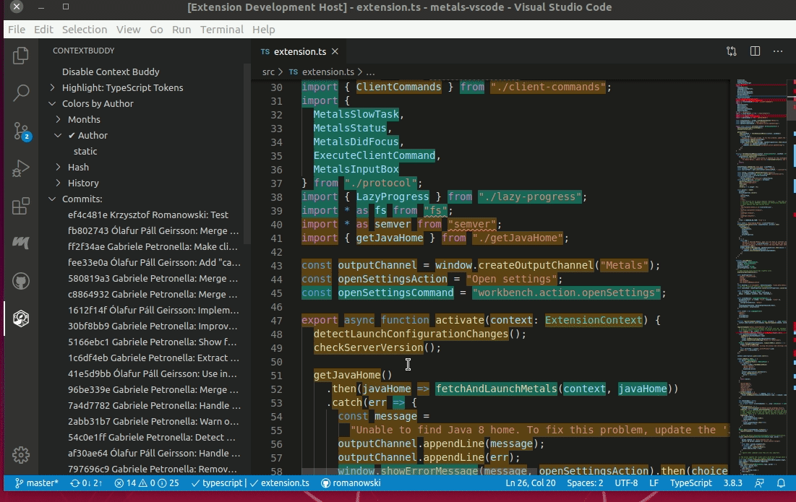

# Context Buddy for vscode

The tool enables detailed examination of project history. Context Buddy scrutinizes historical changes by focusing on specific elements such as method names, parameters, variables, or words, which varies according to the language or format, in contrast to git, which tracks changes line by line.

It means that it assigns multiple commits to a single line, ignores whitespace changes (if they have no semantic meaning) or tracks file renames properly.

This implies that it can attribute a single line to multiple commit histories, overlooks changes in whitespace when they hold no semantic significance, and accurately monitors file renames.

For those curious about the mechanics of this process, we've elaborated on the subject in a [blogpost](https://medium.com/@m.bednarz/165dac84425).

## How to use Context Buddy

### Turning it on/off

Context Buddy is set to inactive by default to avoid daily interruptions for developers. To activate (or deactivate) Context Buddy for a specific file, just run `Context Buddy: toggle` action.

As you may notice it turns Context Buddy only for current file.

Another way to turn on/off Context Buddy it to use button in the provided user interface.

### Highlights: Hovers and color

Once activated, Context Buddy enhances the file by enabling hover functionality over each token, highlighting them based on the most recent commit that impacted them (refer to the various options provided below).

The hover feature displays details about the token, the author, the date, and the commit message. 

**Context buddy provides commits that actually changed given token so it may be different then commit that git blame provides**

### Highlight by: change the way colors are applied

Context Buddy offers various methods for color-coding commits (and the contexts last modified by them).

The color configurations can be adjusted through the user interface or by using specific provided actions.

Additionally, we provide options that can configure colors even further.

Context Buddy can highlight code by (with options):

 * **Hash** - unique color will be assigned for each commit
   * **static** - each commit has the same color assigned across all files (this may make colors less distinct among single file)
 * **Author** - unique color will be assigned for each commit with the same author
   * **static** - each author has the same color assigned across all files (this may make colors less distinct among single file)
 * **Months** - unique color will be assigned for each month as a period of time so November 2018 and November 2019 will have different colors assigned
   * **static** - each month has the same color assigned across all files (this may make colors less distinct among single file)
 * **History** - colors are picked from the gradient, based on git history. As a result, older commits will be assigned with a color similar to the start of gradient. On the other hand, newer commits will be assigned to the color similar to the end of it
   * **discrete** - colors will be picked using a fixed step in gradient (1/N) rather than distance based on relative difference of commit times
   * **reverse** - reverses the ordering
   * **fade** - color will fade out for older commits
   * **color from and to** - colors to construct the gradient

### Select single commit

Context buddy presents a list of all commits that affect the current file and allows us to highlight single commit (to e.g. analyze its impact). 

You can either select the commit once (so other commits are also highlighted) or twice (so only commit in question is highlighted).

   
